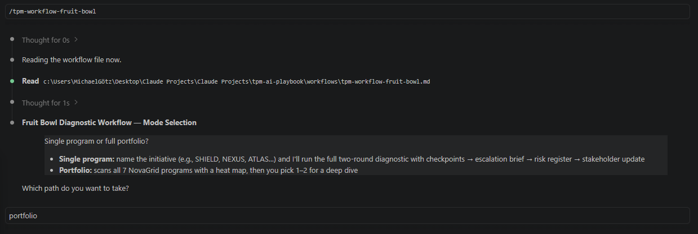
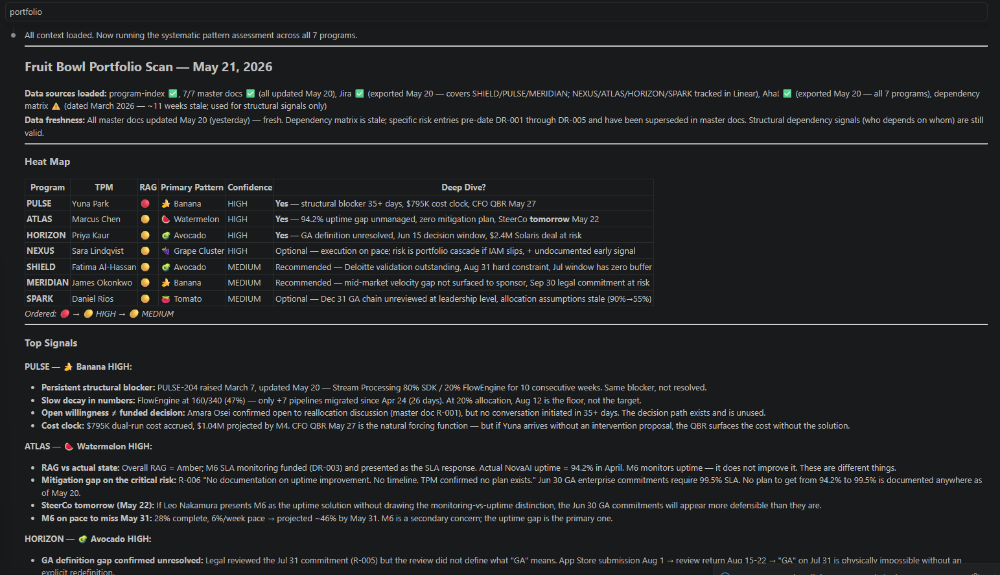
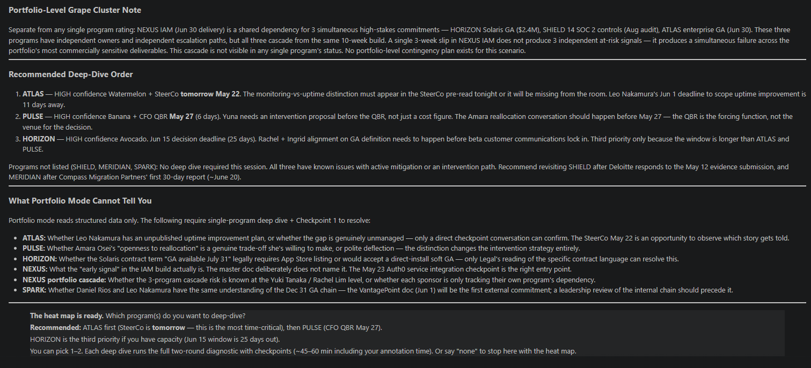
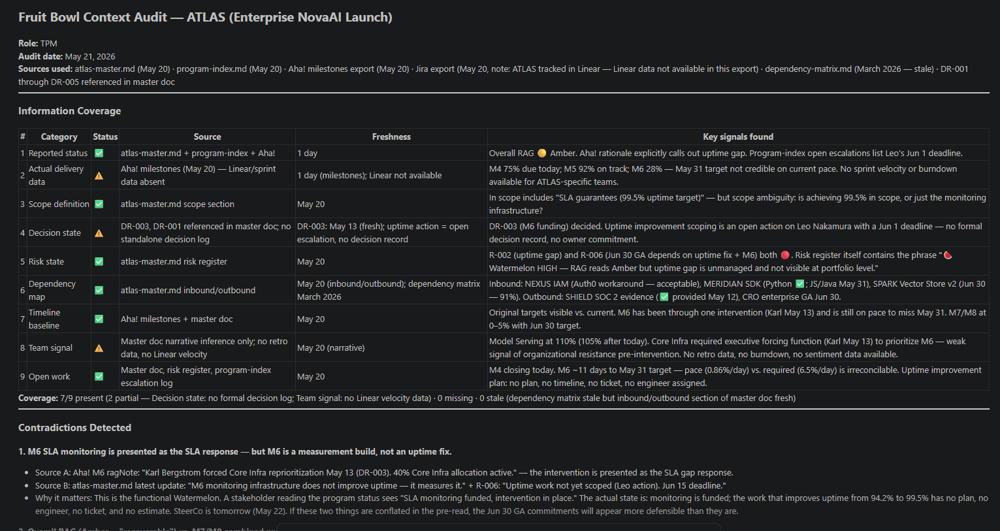
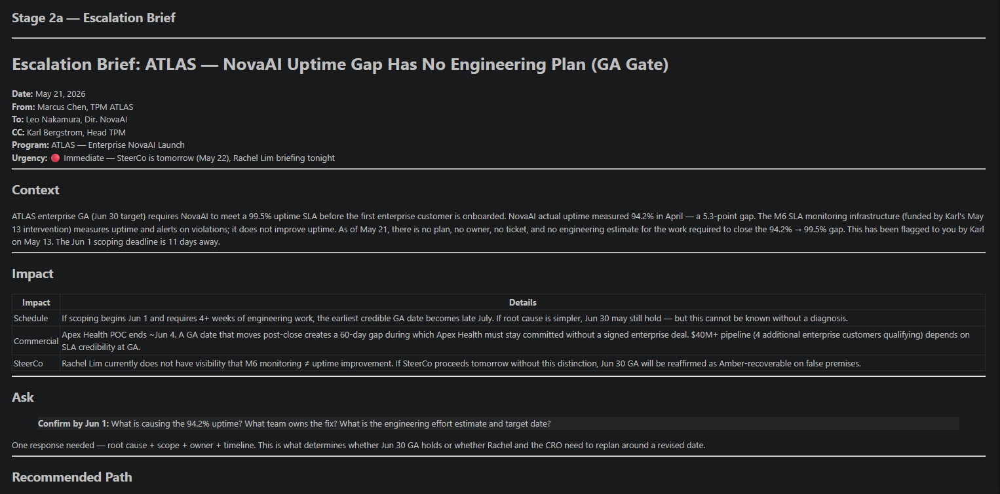
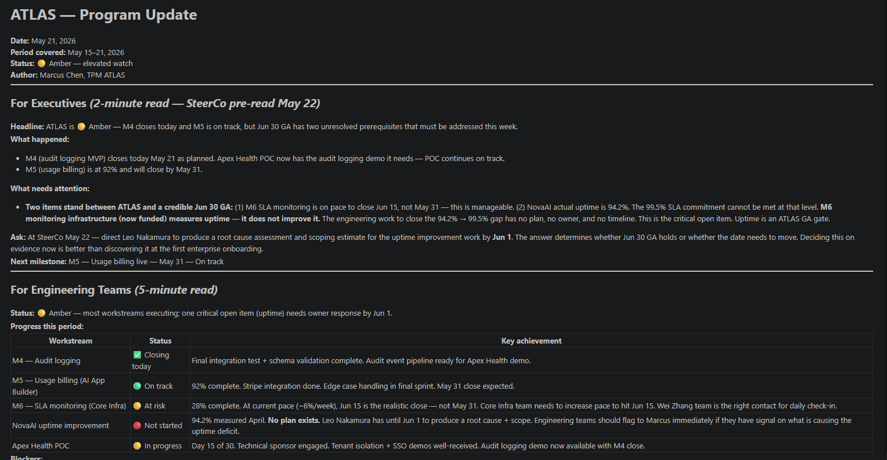

# Your program portfolio has fruit hiding in it. Now you can find it in 10 minutes.

**2026.AI.09** | The Program Fruit Bowl was the most-read article in this series. This is what happens when you turn the framework into a skill and run it against a real portfolio.

*Michi Goetz — June 2026*

---

In February, I published the Program Fruit Bowl: a framework for the seven ways program status lies to you.

🍉 Watermelon. 🥑 Avocado. 🍌 Banana. 🥥 Coconut. 🍇 Grape Cluster. 🍅 Tomato. 🥝 Kiwi.

It became the most shared article I've written. Not because the patterns were new. Every experienced TPM, PM, and engineering lead has seen all seven. Because naming them gave people a vocabulary for something they had sensed but couldn't articulate in a room.

The response I got most often: "I immediately forwarded this to my team."

The second most common: "How do I actually find these faster?"

Here's the difference between the original and this one.

The original gave you prompts. Seven patterns, seven AI prompts, each designed to surface one specific failure mode. You had to know which fruit you were looking for before you could look. And a single AI pass gives you a label: "this might be a Watermelon."

A label is not something you can take into a room with your VP Engineering.

When someone asks "how do you know this program is a Watermelon?", the answer "the model flagged it" ends the conversation badly. The answer you need is: "We ran a structured diagnostic across eight information sources. The skill surfaced three contradictions between reported status and delivery data. I reviewed each one and confirmed the milestone slippage is not known to leadership. Round 2 scored it HIGH confidence Watermelon based on four corroborating signals. Here is the chain of custody."

Single skills produce labels. Workflows with human checkpoints produce defensible diagnostics.

That's what this article is about.

---

## The problem the skill solves

Every program team I've worked with has a version of the same Monday morning ritual. Someone pulls up the portfolio dashboard. Six programs green. Two amber. One red that everyone already knows about.

The green ones are the problem.

Not because they're lying, most of the time. Because the tools we use to report status are optimized for brevity, not accuracy. A status report is a narrative. Narratives have authors with incentives. Jira boards have tickets filed by teams under pressure to show progress. Risk registers get stale the moment they're written.

The gap between reported status and actual state isn't usually dishonesty. It's the natural result of systems that make it easier to say "on track" than to say "here is the specific data that shows we're behind."

The skill exists to close that gap systematically, not heroically.

---

## How it works

The `/tpm-fruit-bowl` skill runs a two-round diagnostic workflow on any engineering initiative: a program, a product launch, a migration, a platform refactor. It works with whatever information is available: markdown files in GitHub, Jira exports, Confluence docs, Aha! milestone data, or anything you paste in.

**Round 1** audits the information landscape. Nine information categories: reported status, actual delivery data, scope definition, decision state, risk state, dependency map, timeline baseline, team signal, open work. For each one: does it exist, how fresh is it, what signals does it contain? Then it surfaces contradictions, places where what someone said conflicts with what the data shows.

This is where something important happens. The skill doesn't just check boxes. It flags absences as signals. No decision log means Avocado risk: decisions may be drifting past their window without anyone tracking them. No dependency map means Grape Cluster risk: hidden interconnections that only become visible during failure. Three or more categories missing means Coconut confirmed: the program's real state requires cracking open a person, not reading a document.

**Checkpoint 1** is where the human enters. Not to declare what exists. The agents already pulled that from connected data sources. To interpret what the contradictions mean. An agent can detect that velocity dropped three sprints in a row while status says green. It cannot know that two engineers were on PTO, or that the risk register is stale because the owner left the company last month, or that the scope is intentionally vague pending a vendor decision.

The checkpoint extracts institutional knowledge precisely where the agent ran out of signal, and nowhere else.

**Round 2** scores all seven patterns with confidence levels. Not "this might be a Watermelon." HIGH confidence Watermelon, based on four specific corroborating signals, with evidence citations and a chain of custody showing what the agent read, what the human confirmed, and what remains unknown.

**Checkpoint 2** is where the human reviews before the diagnostic goes anywhere stakeholders will see.

What the skill will not do: tell you why the slippage happened, whether silence is organizational or interpersonal, or what to say to your sponsor. That's the judgment layer. The skill clears the path to it.

---

## What the portfolio run actually showed

I ran the full workflow against the NovaGrid sandbox on May 21, 2026. One command: `/tpm-workflow-fruit-bowl`. Portfolio mode first, then a single-program deep dive, then the downstream outputs.

*One command. The workflow reads the instruction file, asks single program or portfolio, and routes accordingly.*

*Seven programs scored in a single pass. Patterns, confidence levels, urgency, and recommended deep-dive order.*

The heat map surfaces two things worth naming.

**🍉 The most urgent finding is not the most severe.** The portfolio has programs with larger dollar exposure. But one program has a steering committee the next morning. The skill surfaced that the executive sponsor does not know that the SLA monitoring infrastructure being presented as the fix actually only measures the problem, not solves it. She believes the intervention is in place. It isn't. If that distinction doesn't appear in the pre-read tonight, the GA commitments get reaffirmed on false premises. Time-to-action, not severity, determines where to start.

**🍇 The portfolio-level Grape Cluster note is the diagnostic the heat map can't contain in a row.** One program's core build is a shared dependency for three simultaneous high-stakes commitments: a commercial deal, a compliance audit, and an enterprise launch. A three-week slip in that build doesn't produce three independent at-risk signals. It produces a simultaneous failure across the portfolio's most commercially sensitive deliverables. None of that is visible in any single program's status report.

*The "What Portfolio Mode Cannot Tell You" section names what requires human confirmation at Checkpoint 1.*

---

## The deep dive: what Checkpoint 1 actually does

I took the most time-critical program through the full two-round diagnostic. Round 1 audited all nine information categories and surfaced four contradictions.

*Nine categories audited. Coverage, freshness, contradictions, and hedging language. Before any pattern is scored.*

The most important contradiction was a framing gap, not a data gap. Two different artifacts described the same intervention in incompatible ways. One presented it as the response to a performance problem. The other, more candid, stated plainly that it only measures the problem, not fixes it. Any stakeholder reading only the first artifact would believe an intervention is in place. It isn't. The engineering work required to close the actual gap has no plan, no engineer, no ticket, and no estimate.

Checkpoint 1 asked three questions the data couldn't resolve on its own:

1. Does the executive sponsor know the intervention only measures the problem, not fixes it?
2. Is closing the actual gap a hard launch gate, or aspirational?
3. Is the launch date contractually committed to an external party?

The answers changed the diagnostic. Q1 confirmed the gap is concealed from the sponsor. The Watermelon signal escalated from detected to confirmed. Q2 confirmed it is a hard gate. Q3 confirmed the date is internal, not contractual. The secondary Avocado pattern dropped from HIGH to MEDIUM.

Round 2 output: 🍉 HIGH confidence Watermelon, 🥑 MEDIUM confidence Avocado. Four corroborating signals, all from fresh artifacts. Human confirmation at Checkpoint 1 is what turned a MEDIUM portfolio scan finding into a defensible HIGH confidence diagnostic.

---

## What the workflow produced downstream

Because the diagnostic confirmed HIGH confidence Watermelon, the workflow triggered an escalation brief automatically.

*The escalation brief: specific, named, actionable. Not "there's a risk" but "here is the gap, here is who owns the fix, here is the deadline."*

The brief names the exact distinction the sponsor is missing, the commercial consequence of leaving it unnamed in tomorrow's steering committee, and a single ask: root cause plus scope plus owner plus timeline by a named date. One response needed. Eleven days to get it.

After that, the workflow produced a stakeholder update segmented for three audiences: executives (2-minute read as the pre-read for tomorrow), engineering teams (5-minute read with workstream table and blockers), and all stakeholders.

*The executive section surfaces the critical distinction explicitly. The engineering section names the owners and deadlines.*

Total time from `/tpm-workflow-fruit-bowl` to approved escalation brief and stakeholder update: under an hour, including both checkpoint reviews. The steering committee pre-read is done tonight. Without the workflow, that pre-read either doesn't happen, or it happens without the distinction that changes the room.

---

## Why this is broader than TPM

The original Fruit Bowl article was written for TPMs. This skill isn't.

The seven patterns don't live in programs. They live in any engineering initiative where someone is under pressure to report status, where decisions have windows, where dependencies are implicit, and where team health decays without visible drama.

A PM watching a feature launch slip. An engineering lead managing a migration that's been "80% complete" for three weeks. A staff engineer who knows the tech debt is accumulating but can't articulate the cascade risk in a way that gets leadership attention.

The artifacts are different. PRDs instead of program charters, ADRs instead of decision logs, CODEOWNERS instead of dependency registers. The skill accepts whatever you have. The detection logic is the same.

What changes between roles is what you do with the finding. A Tomato in a PM's feature cycle means recalibrating the estimate before the commitment becomes public. A Tomato in an engineering migration means running a complexity spike before the next sprint starts. Same pattern, different intervention.

---

## How to try it

Start with zero setup. The NovaGrid sandbox is public. Open the TPM AI Playbook repo, run `/tpm-workflow-fruit-bowl` in portfolio mode, and read the heat map. One command, 15 minutes, all seven programs scored. No data wrangling required.

When you're ready to run it against your own programs: the skill is in the open-source TPM AI Playbook on GitHub (`michigoetz/tpm-breakdowns`), under `skills/5-execution-delivery/tpm-fruit-bowl/`. Run it in Claude Code, point it at whatever program artifacts you have.

The gamified version: run it on a program you recently closed, one where you know what the actual state was. See what the skill would have surfaced three months earlier. In my experience, it confirms things you sensed but couldn't name, and occasionally surfaces something you missed entirely. The Tomato on SPARK was in the second category.

---

**The fruit bowl your portfolio is sitting in right now has patterns in it. 🍉🥑🍌🥥🍇🍅🥝** Some you know. Some you sense. Some are hiding in the gap between what the data shows and what the status report says.

You can find them in 10 minutes. Or you can find out when someone else does first.

Now go check your fruit bowl. 🍉

So long,
Michi

---

*The `/tpm-fruit-bowl` skill is part of the TPM AI Playbook. Find the full skill library at `michigoetz/tpm-breakdowns` on GitHub.*

*Previous in the series: [2026.AI.08: The agent didn't fail. Your data layer did.](./2026-AI-08-all-about-templates-data-layer.md)*

---

**Where this fits in the series**

This is article 9 of the TPM AI Playbook. Here is the full arc so far:

- **AI.01-02** — Why TPMs are absent from AI adoption data, and why the same person who plans vacations with Claude won't use it at work ([michigoetz.substack.com/t/practical-ai](https://michigoetz.substack.com/t/practical-ai))
- **AI.03** — Seven program failure patterns AI can surface faster than any status meeting ([Program Fruit Bowl](https://michigoetz.substack.com/p/the-program-fruit-bowl-an-anatomy))
- **AI.04** — Why every program needs a second brain and why NotebookLM is a practical starting point ([NotebookLM article](https://michigoetz.substack.com/p/why-i-think-every-program-needs-a))
- **AI.05** — The Tracker → Orchestrator → AI Architect evolution and the 7-step adoption playbook ([Tracker. Orchestrator. AI Architect.](https://michigoetz.substack.com/p/tracker-orchestrator-ai-tpm))
- **AI.06** — Four skills, one comms agent, one delivery workflow -- and what it found that the TPM missed ([TPM Delivery Agent](https://michigoetz.substack.com/p/the-tpm-had-a-risk-register-agent-skills))
- **AI.07** — 30 power questions no agent can ask for you, in two modes: situational lookup and AI governance pre-flight ([Power Questions](https://michigoetz.substack.com/p/what-ai-reads-what-you-have-to-ask))
- **AI.08** — The data layer that makes everything above it work -- or fail ([Data Layer](./2026-AI-08-all-about-templates-data-layer.md))
- **AI.09** — This article. The Fruit Bowl framework as a full diagnostic skill: two-round workflow, human checkpoints, defensible output.
