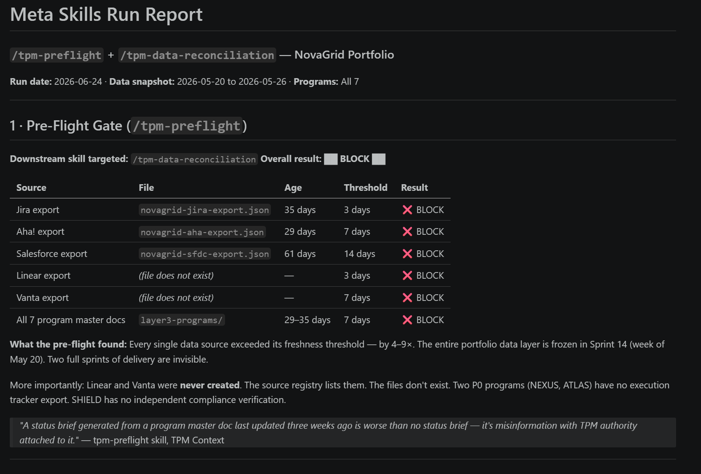
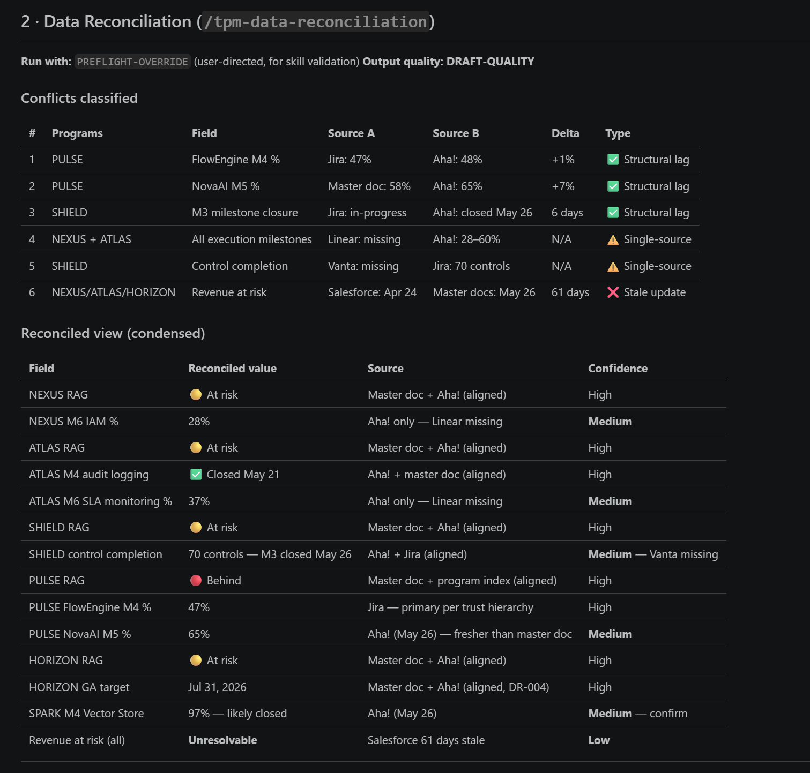
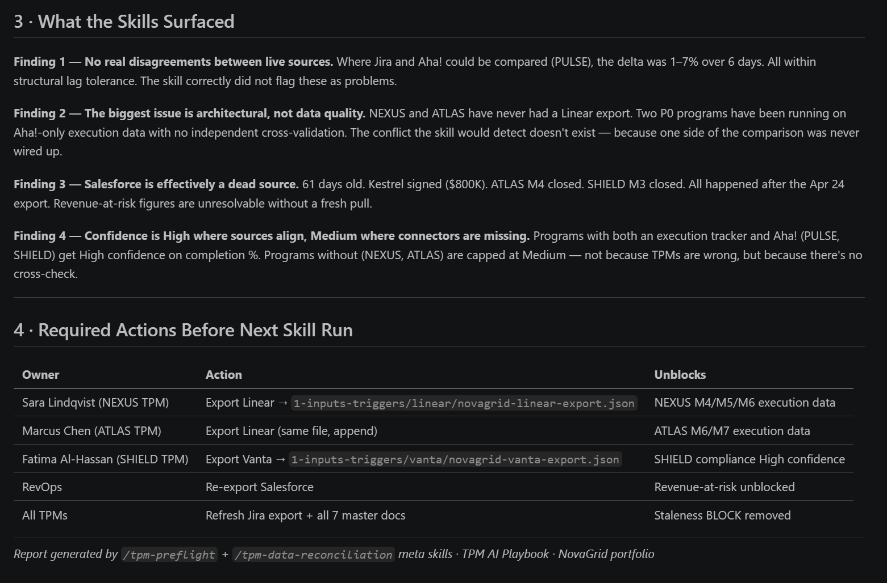

# Your live connector is fresh and still wrong

**2026.AI.13** | *You connected your agent to live Jira and Salesforce and think the data problem is solved. You solved the easy half. Here is the half that got worse.*

*Michi Goetz - June 2026*

---

You wired your agent to a live connector. Cowork pulling Jira at runtime, an MCP connection to Salesforce, a Chrome agent reading Aha! directly. No more stale exports aging on disk. The data is fetched fresh every time you ask.

So the data problem is solved. That assumption is wrong in a way that does not show up until an executive acts on it.

Fresh is not the same as correct. A live connector guarantees the number is current. It guarantees nothing about whether the number can be trusted, because trust does not come from how recent a number is. It comes from whether anything else agrees with it. Put one real-time source next to two slower ones and you have not closed your data gap. You have widened it.

Your live Jira is current to the second. Your Aha! milestones are still TPM-updated weekly. Your master doc moves at the speed of human judgment, whenever the TPM last sat down and thought. Three sources, three different clocks. When the agent reads all three and produces one confident answer, it silently picked which clock to believe, and you never saw the choice.

Freshness was the easy half. Connectors solved it. Knowing which source to trust when they disagree did not get easier. It got harder, because now one side is always moving and the others are not.

## The two failures, and which one your connector fixed

There are two ways the data layer feeds an agent bad input.

The first is staleness: a source not updated since last sprint, presented as current. A live connector mostly kills this. Mostly, because a live pull can still be stale at the source. If nobody updated the underlying record, you are fetching last month's reality with this morning's timestamp.

The second is corroboration, and no connector touches it. When two sources disagree, which is right? When only one source describes a thing, how much do you trust it? A connector makes each number fresher. It does nothing to tell you whether a fresh number has anything backing it up.

That second failure is the entire job once you go live. To show what governing it looks like, I built two gates that run before any skill touches program data and ran them across all seven programs in my NovaGrid sandbox. The sandbox uses exports, so staleness showed up loudly. Read past it. The part that matters on a live connector is what the second gate did.

## Gate one: freshness, the half you mostly solved

Pre-flight reads the age of every source and blocks on the first failure.

| Source | Maximum age | Action if exceeded |
|------------|-------------|-------------------|
| Program master doc | 7 days | BLOCK |
| Jira / Linear | 3 days | BLOCK |
| Aha! | 7 days | WARN |
| Salesforce | 14 days | WARN |
| Meeting notes | 5 days | BLOCK if used as primary input |

WARN means proceed with a caveat, because some lag is expected (Aha! trails Jira by design, Salesforce is sales-owned). BLOCK means stop. A WARN source far enough past its line escalates to BLOCK, because a few days of Aha! lag is normal and three weeks is a dead source. Age is the gap between when the source last reflected reality and now, export or live pull alike. No date behind it at all is a BLOCK. Unknown freshness is unreliable freshness.

In my export-based sandbox, every source was so far past its line it blocked. Jira 35 days against 3, master docs 29 to 35 against 7, both straight BLOCKs. Aha! 29 against a 7-day WARN and Salesforce 61 against a 14-day WARN, both escalated to BLOCK at four times over. The whole portfolio was frozen in May. Two sprints of delivery were invisible, and any skill run against it would have reported May numbers with June confidence.

*On a live connector, most of these rows would pass. That is the point: this gate is the easy half.*

On a live connector, most of those rows pass automatically. If this were the whole article, a reader on live Jira would be right to close the tab. It is not.

One note on the gate's seam: it bends with a logged override, and the override is the most dangerous part. The first is a judgment call. The tenth is a habit, and a gate you override by reflex is a ritual, not a gate. The audit log does not stop you. It makes the pattern visible.

## Gate two: corroboration, the half that gets worse when you go live

Reconciliation runs across every program and classifies each conflict instead of resolving it quietly. This is the gate that matters whether your data is an export or a live stream.

Here is the result that should change how you read your live dashboard. Where sources could be compared, they barely disagreed. PULSE showed FlowEngine at 47% in Jira and 48% in Aha!. Deltas of one to seven points. The gate flagged none of it, correctly. That gap is structural lag, not a discrepancy.

The conflicts I braced for were not the problem. The problem was the comparisons I could not run at all. NEXUS and ATLAS had one source for their execution milestones, nothing to cross-check against. An agent handed a single number treats it as fact. A live connector does not change this. A real-time single-source number is still a single-source number.

So reconciliation hands back a value with a confidence level attached, set by whether anything could corroborate it.

| Field | Value | Confidence | Why |
|-------|-------|-----------|-----|
| PULSE FlowEngine M4 | 47% | High | Jira and Aha! agree |
| NEXUS M6 IAM | 28% | Medium | One source, nothing to confirm it |
| ATLAS M6 SLA monitoring | 37% | Medium | One source, nothing to confirm it |
| SHIELD control completion | 70 controls | Medium | Two sources agree, no third to verify |
| Revenue at risk | Unresolvable | Low | Only source is 61 days stale |

Read down the confidence column, not the value column. The value is what the agent wants to tell you. The confidence is whether you should let it.

*The damage was in the fields with only one source, capped at Medium, and the one with no usable source at all.*

The rule is simple. Two independent sources that agree gets High. A single source caps at Medium, no matter how fresh the connector pulled it. A stale source with no backup gets Low. Confidence is a property of corroboration, not of the number, and not of how recently you fetched it.

That column is the deliverable. It is the difference between an agent that says "NEXUS is 28% complete" and one that says "28% complete, single-source, medium confidence until a second source exists." Your live connector gives you the first. Only a corroboration gate gives you the second.

## Why this is the foundation layer

Both gates run before the agent does anything. They are the layer it stands on.

The field spent the last year moving from tools to orchestration to governance, and the governance conversation is mostly about the agent: evaluate it, keep a human in the loop, approve its actions. One layer too high. If the agent is reasoning over a number with nothing behind it, the approval gate is rubber-stamping a confident guess. Governance that starts at the agent reviews the conclusion without questioning the inputs.

The live-connector era makes this worse, because a fresh number is more tempting to trust than a stale one. Staleness at least looks suspicious. A real-time pull looks authoritative. The connector removed the one cue that used to make you check.

Two honest limits. The gates do not fix anything, they grade and surface. The actual repair, standing up a second source, keeping a master doc honest week over week, is slow human work no skill removes. The master doc is the one source no connector keeps fresh for you, because it is your judgment written down, which is why I keep it as markdown in a repo the agent reads. And clean data is necessary, not sufficient: a high-confidence dashboard can describe the wrong program with total precision. This layer governs whether your numbers are trustworthy, not whether you are pointed at the right outcome. That is still yours.

The most useful output of the run was not a cleaner number. It was a list of owners and the exact source each needs to stand up before the next skill run is trustworthy. The gate did not fix the data layer. It named who owns each fix.

*The deliverable was an owner and an action for every gap, not a number.*

## Run it yourself

Both gates are skills you can run today, in the public playbook repo alongside the execution-health and power-questions skills from the earlier articles.

[github.com/michigoetz/tpm-breakdowns](https://github.com/michigoetz/tpm-breakdowns)

Here is the Monday action, sharper if you are already on live connectors. Point reconciliation at one program where you have exactly one source for a key number. Watch it cap that number at Medium while your live dashboard shows it in confident green. The first time you see a fresh number graded as untrustworthy, you stop mistaking current for correct.

The connector made your data fresh. It did not make it true. The gate before the agent is what tells the difference.

---

*Let's build.*

*Michi*

---

## Where this fits in the series

- **AI.01-02** - Why TPMs are absent from AI adoption data, and why the same person who plans vacations with Claude won't use it at work
- **AI.03** - Seven program failure patterns AI can surface faster than any status meeting ([Program Fruit Bowl](https://michigoetz.substack.com/p/the-program-fruit-bowl-an-anatomy))
- **AI.04** - Why every program needs a second brain and why NotebookLM is a practical starting point ([NotebookLM article](https://michigoetz.substack.com/p/why-i-think-every-program-needs-a))
- **AI.05** - The Tracker to Orchestrator to AI Architect evolution and the 7-step adoption playbook ([Tracker. Orchestrator. AI Architect.](https://michigoetz.substack.com/p/tracker-orchestrator-ai-tpm))
- **AI.06** - Four skills, one comms agent, one delivery workflow and what it found that the TPM missed ([TPM Delivery Agent](https://michigoetz.substack.com/p/the-tpm-had-a-risk-register-agent-skills))
- **AI.07** - 30 power questions no agent can ask for you, in two modes: situational lookup and AI governance pre-flight ([Power Questions](https://michigoetz.substack.com/p/what-ai-reads-what-you-have-to-ask))
- **AI.08** - The data layer that makes everything above it work or fail ([The data layer article](https://michigoetz.substack.com/p/the-agent-didnt-fail-your-data-layer))
- **AI.09** - The Fruit Bowl skill: how a label becomes a defensible diagnostic, and what the portfolio scan found ([Fruit Bowl skill article](https://michigoetz.substack.com/p/your-program-portfolio-has-fruit))
- **AI.10** - The coordination problem that appears one layer above the data layer, and what the TPM owns at the boundary
- **AI.11** - 32 AI terms every TPM should actually know (Part I): AI fundamentals and agentic systems vocabulary
- **AI.12** - 32 AI terms every TPM should actually know (Part II): AI adoption inside orgs and the TPM-specific edge
- **AI.13** - This article. The gate before the agent: freshness and corroboration, the two data-trust problems a live connector makes harder, not easier.

---

*This article is published on Substack: [michigoetz.substack.com/p/your-live-connector-is-fresh-and](https://michigoetz.substack.com/p/your-live-connector-is-fresh-and)*

*Skills and templates live in the public repo: [github.com/michigoetz/tpm-breakdowns](https://github.com/michigoetz/tpm-breakdowns)*
