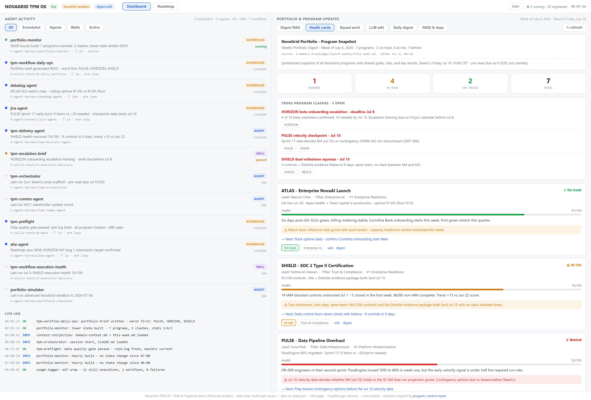
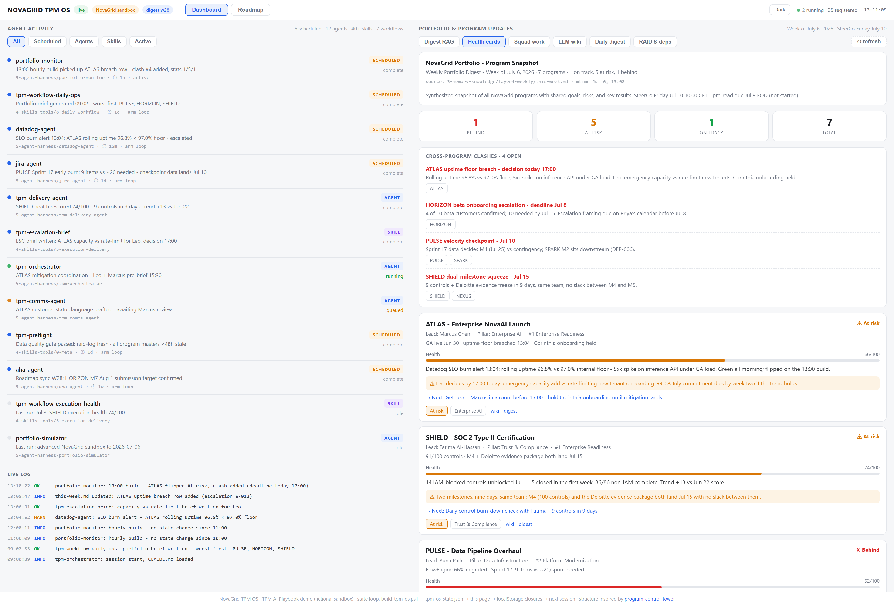

# 🖥️ I don't read my portfolio anymore. It reports to me every hour.

**2026.AI.14** | *The Daily 360: one morning spin-up, seven programs on one page, and the alert that proved the point.*

*Michi Goetz - July 2026*

---

Monday, 8:55. Seven programs. SteerCo on Friday.

You know the ritual. Open Jira, walk seven boards. Open Aha!, check which milestones moved. Open Salesforce, scan the deals your programs are gating. Open the RAID log and try to remember which risks you updated and which ones just look updated. Open last week's notes to reconstruct what you promised whom.

Four tools, seven programs, one question: what actually changed since Friday?

By the time you've assembled the answer, it describes yesterday. And you've spent the sharpest ninety minutes of your week on collection, not on a single decision.

Here's the claim, and it's not a time-savings claim: **the morning was never for collecting. Collection was the tax you paid to start thinking.**

I call the alternative the Daily 360: a portfolio-wide view, rebuilt every hour from data you own, that remembers what you handled and carries it into the next run. You open one page, the portfolio is already synthesized, and you start the day deciding what moves instead of discovering what happened. It's written for the seat that runs several programs at once; the one-program version waits at the end.

The 2026 State of AI for TPMs survey (n=252) shows most of us automated the easy layer: 83% use AI for meeting summaries. The want-list is elsewhere - 57% want it for cross-program dependencies, against 38% who have it. That gap is exactly what a portfolio 360 covers. And the real divide isn't a better prompt. It's whether AI is a feature you use or infrastructure you run on.

A Daily 360 is infrastructure.

---

## But I already have a dashboard

Every tool in your stack ships one. Jira has dashboards. Aha! has dashboards. Your BI team has dashboards about the dashboards.

Three things make this different.

**It synthesizes across the state layer, not inside one tool.** The page reads the weekly operating state and the RAID log - the layer where Jira epics, Aha! milestones, Salesforce deals, Datadog SLOs, and Vanta controls have already been reconciled into one picture (the data layer from Article 8, the integration contract from Article 10). A tool dashboard shows you that tool. The 360 shows you the portfolio.

**Closures flow back.** When I close an action, it persists and feeds the next agent session as context. Tomorrow's read knows what I handled today. A dashboard you read is a snapshot; a dashboard that remembers is a state loop. You can also point it at a GitHub repository to keep that state consistent across sessions and machines.

**Freshness is scheduled, not remembered.** A watcher script rebuilds the page every hour and logs each run. Nobody has to remember to refresh. Freshness is a property of the system, not of my discipline on a bad Tuesday.

---

## The setup

The portfolio here is NovaGrid - the fictional sandbox behind the TPM AI Playbook: seven programs, five live data sources (Jira, Aha!, Salesforce, Datadog, Vanta), a RAID log, and a weekly operating file. Everything below is a real session against that sandbox, on its simulated clock. The library is public (link at the end).

The chain is short:

```
this-week.md + raid-log.md          (the state layer)
        |
build-tpm-os.ps1                    (parses -> tpm-os-state.json)
        |
tpm-os.html                         (one page: clashes, health cards, agent activity)
        |
watch-tpm-os.ps1                    (rebuilds hourly, logs each run)
```

Monday 9:00, the spin-up. Two artifacts appear.

First, the portfolio brief - one short block per program, worst first: status, the blocker that matters, one next action. The data-pipeline program red on a velocity checkpoint. The mobile program four beta customers short with a week to its deadline. The compliance program facing two milestones in the same nine days, on one team. Generated at 9:02.

Second, the page. I call this view the Daily 360; in the sandbox it runs as the NovaGrid TPM OS.


*09:00 build (sandbox clock): seven programs, three clashes with deadlines this week, two programs green for the first time this quarter. Left pane: the agents and skills that assembled the page, with the build log as the receipt.*

Scan time: a few minutes. It answers the Monday question - what changed, what clashes, whose decision is due - and the whole morning ritual compresses into it. Not because anyone reads faster. Because the collection already happened in the state layer.

Here's what matters more than the minutes saved: what the first hour produced. By 9:40 the mobile program's onboarding escalation was framed and on the right calendar ahead of its deadline, and contingency options for the data-pipeline checkpoint were drafted two days before the data lands - the two decisions the brief flagged as this week's real work. The old ritual ended at "now I know." This one ends at "now it's forced." **Detection is the system's job. Leading programs is yours - and forcing is what the morning is for now.**

Then the page just stays open. And that's where Monday got interesting.

---

## 13:04

The Datadog SLO burn alert fired at 13:04. ATLAS - the enterprise launch that went live six days ago, green all morning - dropped below its uptime floor: 96.8% rolling against a 97% floor, a 5xx spike on the inference API under launch load.

(By the last article's rules that's a single-source number - but a pager computed from primary telemetry earns a different trust contract than something a human typed. Know which of your sources is which.) Read the gate argument here: [Your live connector is fresh and still wrong](https://michigoetz.substack.com/p/your-live-connector-is-fresh-and).

The alert landed in the weekly state file. In production an agent writes that row; in this run I played that role by hand. Either way the write is what matters: the next hourly build picked it up, no human refreshed anything. At 13:10 the page looked like this:


*13:10 build: a fourth clash at the top of the stack with a deadline of "today 17:00". ATLAS flipped amber. On-track count went from 2 to 1. The live log shows the chain: 13:04 alert, 13:08 state-file write, 13:10 build.*

Read the diff between the two screenshots, because the diff is the product:

- The clash list grew from three to four, and the new one sorted to the top with the only same-day deadline: one lead has to choose by 17:00 between an emergency capacity add and rate-limiting new customer onboarding.
- The ATLAS card flipped green to amber and its next actions changed. The morning's "track uptime daily" became "get the two decision-makers in a room before 17:00" and "hold new-customer onboarding until the fix lands."
- The blast radius came with it: a new customer onboards this week, and the July uptime commitment dies by week two if the trend holds.

Nobody re-read seven programs at lunch. Nobody was even looking at ATLAS - it was green at 9:00, and green programs don't get midday attention. The system surfaced one change and what it touches.

That's the argument for the Daily 360. The morning spin-up saves you the collection ritual once. The hourly loop does what the ritual never could: it surfaced at 13:10 what would otherwise have waited for tomorrow's ritual - or worse, Friday's SteerCo prep. The feedback loop between portfolio state and your attention shrank from days to an hour.

---

## What the hourly loop does not fix

Three honest limits, and the first matters most.

**The loop guarantees the page matches the state layer. It does not guarantee the state layer matches reality.** This is the Article 13 problem one level up: fresh is not correct. If the RAID log is aspirational, the page renders aspiration every hour, on schedule, with a reassuring timestamp. The refresh log proves cadence. It proves nothing about truth. The state layer is still owned, and maintained, by a human - which is the job.

**The card narratives are curated, not parsed.** The stats, clashes, and RAID rows come straight from the state files. The "what's hot" line on each card is agent-synthesized and reviewed. A stale narrative next to fresh numbers is this system's ugliest failure mode, because it looks current. Name the week-two scenario before it happens: delivery pressure spikes, the narratives stop riding along, and the page keeps rendering on schedule - degrading silently, which is the dangerous way. If the state layer has gone quiet for a week while the portfolio hasn't, the silence is the signal.

One governance note for when this scales past your own desk: the closures are context for agents, not a productivity log about people. The first manager who reads them as performance data kills the habit, and the state layer's honesty dies with it.

**The 360 sees systems, not people - and only the systems you track.** The alert told me the floor broke. It didn't tell me which option the lead would pick, who had already floated a start date to the new customer, or whose yes unlocks emergency spend on a Monday afternoon. That context isn't in any file the parser reads - and neither is the email thread, the vendor portal, or the doc nobody exports. The page put the decision on the board by 13:10. The decision itself stayed exactly where it belongs.

---

## The IC entry point

You don't need seven programs or a full portfolio page. The pattern is three pieces, and it scales down to one program:

1. **One state file** - a markdown page holding the reconciled truth of your program: status, top risks, open decisions, dates. You probably half-maintain this already.
2. **One render step** - a script (or a skill) that turns the state file into the page you actually want to scan at 9:00.
3. **One schedule** - an hourly task that runs the render and logs that it ran.

Budget honestly: the one-program version is an afternoon, most of it spent writing the state file you should have anyway. Anyone who tells you this is free hasn't maintained one. One enterprise note: check your data-handling policy before exporting program data to local files - the pattern runs on whatever storage your org approves.

And run the honest experiment before you build anything bigger. The riskiest assumption here isn't technical - it's that you'll keep the state file current. So test exactly that: run the one-program version for two weeks. If you're still updating the file on day ten, build the rest. If you're not, you learned the most important thing about your setup for the price of an afternoon.

The Monday action: write down the two questions you re-answer from scratch every morning, build the state file those questions would read from, and automate the read. You'll know it's paying the first week it catches something you'd otherwise have found on Friday - and when your page catches its first 13:04 while you were in a meeting, tell me in the comments.

---

## Run it yourself

The tower, the watcher, and the brief skill are all in the public playbook repo - alongside the execution-health and power-questions skills from the earlier articles. You can find the [TPM AI Playbook here](https://github.com/michigoetz/tpm-breakdowns). Feel free to contribute.

The Daily 360 is one surface of a larger system: inputs and triggers at the bottom, memory and skills in the middle, agents above, and one page where it all lands.

**Credits & inspiration:** while I was hunting for a control-tower / Daily 360 shape and building dashboards these last months, Edoardo Romani (reach out to him for the London TPM community) posted a great control tower on GitHub. Check it out.

Next week: more on the full agentic AI architecture behind this, plus updates to the GitHub repo incoming.

Read the other articles in the [Practical AI series](https://michigoetz.substack.com/t/practical-ai).

*Let's build.*

*Michi*

---

**Where this fits in the series**

- **AI.01-02** - Why TPMs are absent from AI adoption data, and why the same person who plans vacations with Claude won't use it at work
- **AI.03** - Seven program failure patterns AI can surface faster than any status meeting ([Program Fruit Bowl](https://michigoetz.substack.com/p/the-program-fruit-bowl-an-anatomy))
- **AI.04** - Why every program needs a second brain and why NotebookLM is a practical starting point ([NotebookLM article](https://michigoetz.substack.com/p/why-i-think-every-program-needs-a))
- **AI.05** - The Tracker to Orchestrator to AI Architect evolution and the 7-step adoption playbook ([Tracker. Orchestrator. AI Architect.](https://michigoetz.substack.com/p/tracker-orchestrator-ai-tpm))
- **AI.06** - Four skills, one comms agent, one delivery workflow and what it found that the TPM missed ([TPM Delivery Agent](https://michigoetz.substack.com/p/the-tpm-had-a-risk-register-agent-skills))
- **AI.07** - 30 power questions no agent can ask for you ([Power Questions](https://michigoetz.substack.com/p/what-ai-reads-what-you-have-to-ask))
- **AI.08** - The data layer that makes everything above it work or fail ([The data layer article](https://michigoetz.substack.com/p/the-agent-didnt-fail-your-data-layer))
- **AI.09** - The Fruit Bowl skill: how a label becomes a defensible diagnostic
- **AI.10** - The agent coordination problem and the integration contract at the program boundary
- **AI.11-12** - The TPM AI glossary: the vocabulary of agentic program management
- **AI.13** - Your live connector is fresh and still wrong: the gate before the agent
- **AI.14** - This article. The Daily 360: the portfolio page that reports to you every hour, and what stays human.
