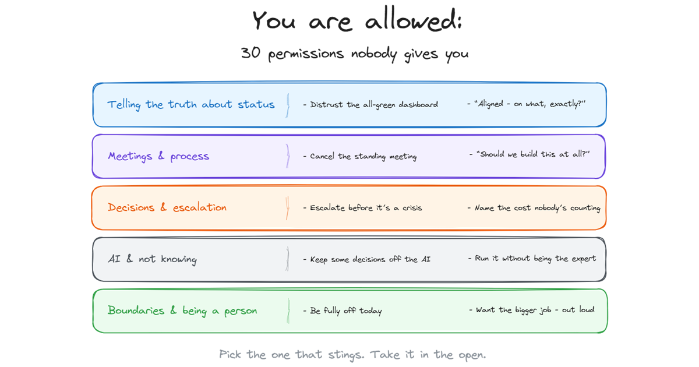

# You're allowed to cancel the meeting. And 29 other permissions nobody gives you.

**The Seat · No. 01** | *The permissions your job description doesn't mention, your manager assumes you know, and your calendar quietly forbids.*

*Michi Goetz - July 2026*

---

*This kicks off **The Seat** - a new strand of TPM Breakdowns on the craft of the TPM job itself: the permissions, the org design, and the career calls nobody hands you. Practical AI covers the tooling; The Seat covers the seat.*

Nobody hands you these.

There's no onboarding slide that says you're allowed to cancel the meeting, distrust the green dashboard, or take a beat before pretending you're fine with the reorg. The permissions that make someone good at this job travel by observation: you watch a leader you respect do the thing you assumed was forbidden, and something unlocks.

For the past few months I've been publishing one of these at a time as short notes. Each one names something people already believed and didn't quite know they were allowed to act on.

This is the collection: 30 permissions, grouped by where they bite - you're looking for one, not all thirty. They're written for TPMs because that's my seat, but the EMs and PMs who see themselves in them prove the seat doesn't matter much.

One thing before the list, because it's the honest fine print: **a permission is not an exemption.** Every one of these assumes you'll exercise it with judgment, in the open, and own the outcome. "You are allowed to cancel the meeting" is not "you are allowed to disappear." The permission removes the fake barrier - the theater, the guilt, the imagined rule. What's left is the real accountability, which was always yours.

And they don't all cost the same. Cancelling a stale meeting costs you nothing. A couple of these - deciding without the room, or retiring a metric leadership loves - can cost you real capital with someone senior, and I've flagged those two. Take them with more care, not less nerve.

---

## On telling the truth about status

**1. You are allowed to say "I don't have an update yet."** Not every status request needs an immediate answer. Being responsive doesn't mean being reactive.

**2. You are allowed to distrust a dashboard that's all green.** Especially the one that's been all green for six weeks. Real programs have yellow. A dashboard with no yellow isn't a healthy program - it's a reporting problem.

**3. You are allowed to question the metric.** "This is green - but what does green mean for this team?" "We hit the number - but is the number still the right number?" The leader who only reads the dashboard is seeing the program everyone agreed to report.

**4. You are allowed to trust what you're sensing over what the dashboard says.** The program is green, but the lead engineer has gone quiet. The metrics are fine, but the standups feel off. The dashboard shows the program everyone agreed to report. The signal shows the one that's actually happening.

**5. You are allowed to name the thing in the room.** Not as an accusation - as an observation. "I notice we keep talking around X without naming it directly. Can we spend 10 minutes on the actual issue?"

**6. You are allowed to puncture the comfortable nod.** When the room says "we're aligned," ask: "great - aligned on what, specifically?" It feels like slowing things down. It's preventing the three-different-versions disaster that surfaces two weeks from now.

## On meetings and process

**7. You are allowed to cancel the standing meeting.** The one that's been on the calendar so long nobody remembers who set it up or why. "This meeting solved a problem we no longer have. I'm cancelling it. If we miss it, we'll bring it back."

**8. You are allowed to call the alignment meeting what it actually is - a missing decision.** If the same people have met three weeks running and nothing has been decided, the problem isn't alignment. It's an unresolved decision that needs an owner, not another meeting.

**9. You are allowed to walk into a 1-on-1 with no agenda.** Not every conversation needs an action item. Sometimes the most useful thing you can give someone is 30 minutes where nothing is owed. "No agenda today. What's on your mind?"

**10. You are allowed to say "this process isn't working."** Not as a complaint - as a proposal. "This retro format has produced the same action items three times. Here's what I'd like to try instead." That's not disruption. That's leadership.

**11. You are allowed to ask the question everyone skips: "Should we build this at all?"** Not "can we?" Not "by when?" Should we. In a roadmap meeting full of how and when, the person who asks whether is doing the most senior work in the room.

**12. You are allowed to repeat yourself.** The message you're tired of delivering is the one most people are hearing for the first time. Saying it once was documentation. Saying it until it lands is communication.

## On decisions and escalation

**13. You are allowed to make the decision without everyone's input.** Not every decision needs a committee. Sometimes the most responsible thing is: gather the essential perspective, make the call, tell people what you decided and why. *One of the costly ones: use it where the decision is genuinely yours to own, not to skip a conversation you owe someone.*

**14. You are allowed to escalate before it's a crisis.** There's a myth that escalating early makes you look like you can't handle it. The opposite is true. The leader who escalates a risk while there's still time to act on it looks far better than the one who waited until it was an emergency.

**15. You are allowed to start the quarter by stopping things.** Not every program from last quarter deserves to continue. Not every commitment made in March still makes sense in July. Starting strong doesn't mean starting with more.

**16. You are allowed to retire a metric you introduced.** Even one you championed. Even one on a leadership dashboard. If the number is going up while the outcome stays flat, the metric isn't measuring success. It's manufacturing it. *One of the costly ones: bring the outcome data before you propose killing a number leadership likes - the evidence is what makes it land instead of look like retreat.*

**17. You are allowed to put a number on the cost nobody's counting.** The time your team loses validating AI output - 45% of TPMs in the 2026 State of AI for TPMs survey report spending real hours every week on exactly that, and almost nobody budgets for it. The three days every launch loses to the workaround nobody fixed. Invisible costs don't get budgeted because they don't get named.

**18. You are allowed to raise the security question before anyone makes you.** You don't need to be the security expert. You need to be the person who asks "what's our attack surface here?" before the tool ships - not after the incident.

## On AI, expertise, and not knowing

**19. You are allowed to say "I don't know" in front of your team.** Leaders who pretend to have all the answers don't build trust. They build a team that stops asking real questions. "I don't know - let's figure it out together" is the signal that says: it's safe to not know things here.

**20. You are allowed to be the least technically experienced person in the room.** And still run the program. Your value isn't knowing the answer to every technical question. It's creating the conditions where the right technical questions get asked, by the right people.

**21. You are allowed to be a leader who's still figuring out AI.** You don't have to be the most fluent person on the team - almost no one is. In the 2026 survey of 252 TPMs, 63% rated themselves Beginner or Developing and 95% wanted to learn more. "I'm still figuring out where this helps - let's learn it together" is a stronger signal than pretending you've mastered it.

**22. You are allowed to keep some decisions entirely off the AI.** The promotion call. The "is this person okay" read. The decision that depends on a history no model has access to. Using AI well isn't using it for everything - it's knowing which decisions require a human who was in the room, and protecting those.

**23. You are allowed to kill the AI pilot that isn't landing.** Not every experiment has to become a deployment. The leader who keeps a dead pilot on life support to avoid admitting it didn't work is spending trust to protect ego.

## On boundaries and being a person

**24. You are allowed to end the week without everything resolved.** Not every risk has to be mitigated by Friday. Some problems get clearer with distance. Rest isn't a reward for finishing - it's a requirement for the thinking you'll need next week.

**25. You are allowed to protect the long weekend.** Not every deploy needs to ship before Friday. Not every "small change" is worth someone's Saturday. The trust you build by protecting your team's rest compounds longer than any sprint.

**26. You are allowed to be fully off - and let the message wait.** Not "off but checking Slack." Off. The "quick question" that feels urgent at 2pm Saturday is almost always fine by Monday 9am, and the program does not need you to watch it rest.

**27. You are allowed to say no to your own manager.** Not defiantly - with a reason and a trade. "I can't take that on without dropping X. Which matters more?" The people who never push back aren't more valuable. They're just more overloaded.

**28. You are allowed to not be instantly fine with a change you didn't choose.** The reorg. The cancelled program. You can lead your team through it and still need a beat to absorb it yourself - just take that beat in private or with a trusted peer, because in the room your reaction quietly becomes the team's.

**29. You are allowed to ask for a longer transition period.** "Two weeks isn't enough to hand over this program. I'd like three - here's what I need to cover." That's not a failure of efficiency. It's an investment in the program's success after you leave.

**30. You are allowed to want the bigger job.** Out loud. To your manager, in those words. Ambition isn't a character flaw you confess - it's information your leadership needs in order to help you. The people who got the role you want said they wanted it.

---

## How to actually use this

Don't try to adopt thirty permissions. That's a poster, not a practice.

Pick the one that made you uncomfortable. That discomfort is precise - it's pointing at the permission you need and haven't been taking. Use it once this week, in the open, and own how it goes. Permissions taken quietly don't change anything; permissions taken visibly give everyone watching the same unlock you got from whoever you learned it from.

That's the real mechanic of this list. None of these permissions are mine to grant. They become real in a team the first time someone senior enough takes one where everyone can see. If that's you - and if you lead anyone, it is - then this list isn't for your bookmarks. It's for your next meeting.

Which one did you need today? Tell me in the comments - the next thirty will come from what's missing.

---

*Let's build.*

*Michi*

---

*TPM Breakdowns publishes a deep-dive every Wednesday - practical AI workflows for TPMs (Practical AI) and the craft of building the TPM function (The Seat). The permission statements appear daily as Notes. [Subscribe at michigoetz.substack.com](https://michigoetz.substack.com)*
